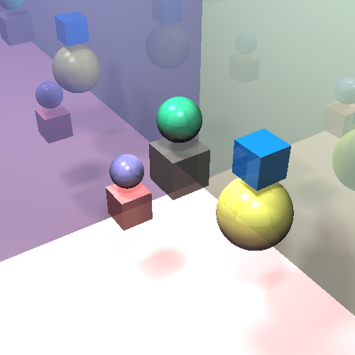

# Basic Ray Tracer in Python

This project implements a basic ray tracer in Python, designed to simulate light interactions with 3D surfaces and create realistic renderings. The ray tracer supports customizable scene files, allowing for flexible configurations of lights, materials, and camera settings.

## Features

- **Supported Surfaces**: Spheres, planes, and cubes (axis-aligned).
- **Material Properties**: Handles diffuse, specular, reflection, and transparency.
- **Lighting**: Point lights with adjustable color, intensity, and soft shadows.
- **Camera Settings**: Customizable position, direction, and screen dimensions.
- **Scene Files**: Easily configurable scene files for defining objects, materials, and lighting in the scene.

## How It Works

The ray tracer generates rays from the camera through each pixel of the image, calculating intersections with objects in the scene. It then determines the closest intersection point, computes the resulting color based on material and lighting properties, and renders the pixel with the appropriate color. For surfaces with reflection or transparency, additional rays are traced recursively up to a specified depth.

## Example Output

Below are examples of images rendered using this ray tracer:

**Example 1:**  

**Example 2:**  

# Repository Structure

camera.py
color.py
intensity.py
intersections.py
light.py
material.py
output/
├── ... (rendered output images)
ray_tracer.py
ray.py
scene_settings.py
scenes/
├── sample_scene.txt (sample scene configuration file)
surfaces/
├── cube.py (defines cube surface)
├── infinite_plane.py (defines infinite plane surface)
├── sphere.py (defines sphere surface)
├── surface.py (base class for surfaces)
transform_utils.py
README.md
